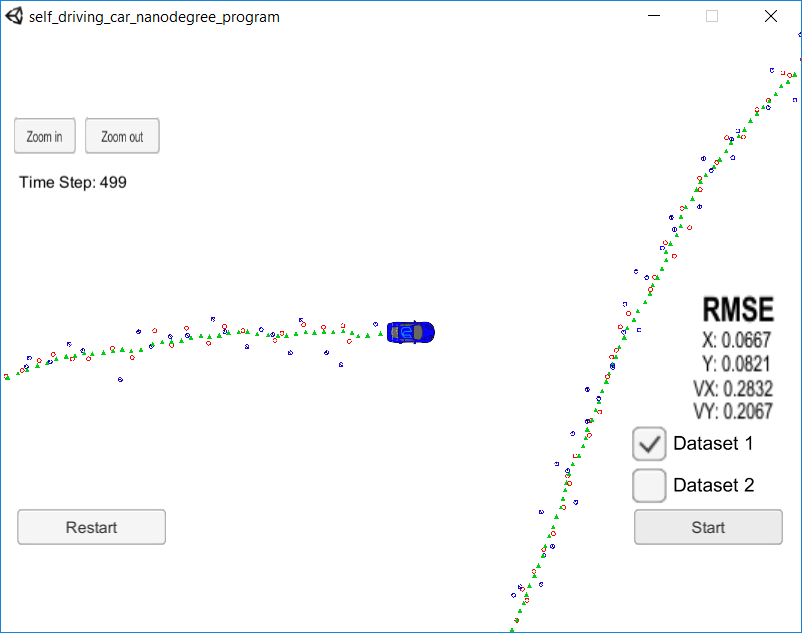
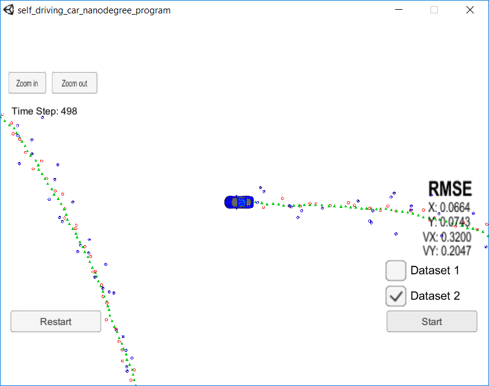

# Self-Driving Car Nanodegree Program - Term 2
## Project 2 - Unscented Kalman Filter
**Ricardo Picatoste**

## Notes
The project has been compiled in Windows 10 using the "Bash on Ubuntu on Windows", generating the make file with "cmake CMakeLists.txt" and then running make. 

I have used a tab width of 4 spaces, taking care of the matrices alignment. I hope it's ok, I prefer it like that for programming.

In ukf.cpp, the define DEBUGGING can be set to 1 or 0 in order to print debugging information.

## Results

The RMSE achieved is below the required maximum limit, and improves clearly the result obtained in the previous project with the Extended Kalman filter.

Below there is a capture after finishing the dataset 1:

Below there is a capture after finishing the dataset 2:

